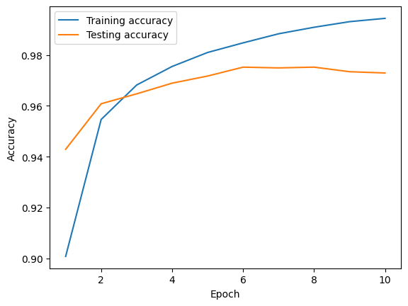

# Neural Network From Scratch

A custom neural network framework built in Python that uses NumPy for all core tensor operations. Optional GPU acceleration is supported through custom CUDA kernels integrated via Pybind11.

## Features
- **Flexible architecture**  
  - Layers: Dense, Dropout, Input, Flatten  
  - Activations: ReLU, Softmax, Linear, Sigmoid  
  - Initializers: He Normal, He Uniform, Xavier Normal, Xavier Uniform, Orthogonal, Zeros  

- **Training tools**  
  - Losses: Categorical Cross-Entropy, Softmax Cross-Entropy, Mean Squared Error  
  - Metrics: Categorical Accuracy  
  - Optimizer: Adam  

- **GPU acceleration (optional)**  
  - Custom CUDA kernels for faster forward/backward passes  
  - Pybind11 bindings for seamless C++/Python integration  

- **User-friendly utilities**  
  - Save/load models  
  - Model summary  
  - Training performance plots  

- **Highly modular**: easily extend or swap out components

## Installation

**Clone the repo**
```sh
git clone https://github.com/kiran-jones/nnfs.git
```

**Create a virtual environment**
```sh
python -m venv venv
source venv/bin/activate    # macOS/Linux
venv\Scripts\activate       # Windows
```
```sh
pip install -r requirements.txt
cd py_modules
python setup.py install
```

## Quick Start
Below is a basic example of how to construct and train a neural network using this framework: 

```python
import numpy as np
from py_modules import (
    Network, Dense, ReLU, Softmax,
    CategoricalCrossEntropy, Categorical, Adam
)

# Load the data
X_train = np.load("path/to/X_train.npy")
y_train = np.load("path/to/y_train.npy")
X_test  = np.load("path/to/X_test.npy")
y_test  = np.load("path/to/y_test.npy")

# Instantiate the network
nn = Network()

# Define the layers
nn.add(Dense(128)).add(ReLU()) \
.add(Dense(100)).add(Softmax())

# Set the loss, accuracy, and optimizer
nn.set(
  loss=CategoricalCrossEntropy(),
  accuracy=Categorical(),
  optimizer=Adam()
)

# Finalize the network for training
nn.finalize(input_shape=(None, X_train.shape[-1]))

# Train network
nn.train(
  X_train, y_train,
  validation_data=(X_test, y_test),
  epochs=10,
  batch_size=128,      
  print_every=64,
  plot=True
)

# Inspect the model
nn.summary()
``` 


## Performance 
Below is an example of tracking training & validation metrics on the MNIST dataset with the sample architecture listed above:

```
Epoch 0/10
Batch: 1/469 Total Loss: 4.8363 Accuracy: 0.0000 
Batch: 65/469 Total Loss: 0.6261 Accuracy: 0.8438 
Batch: 129/469 Total Loss: 0.2717 Accuracy: 0.9453 
Batch: 193/469 Total Loss: 0.3386 Accuracy: 0.8984 
Batch: 257/469 Total Loss: 0.2796 Accuracy: 0.9297 
Batch: 321/469 Total Loss: 0.2961 Accuracy: 0.9219 
Batch: 385/469 Total Loss: 0.2800 Accuracy: 0.9141 
Batch: 449/469 Total Loss: 0.0874 Accuracy: 0.9688 
Batch: 469/469 Total Loss: 0.2444 Accuracy: 0.9792
...
Train Epoch 10/10: Accuracy: 0.9944 Loss: 2.8254 
Validation Epoch 10/10: Accuracy: 0.9729 Loss: 0.0012 
```



## Sources
- [NumPy Documentation](https://numpy.org/doc/)
- [CUDA C++ Documentation](https://docs.nvidia.com/cuda/cuda-c-programming-guide/)
- [Pybind11 Documentation](https://pybind11.readthedocs.io/en/stable/) 
- [Neural Networks from Scratch in Python](https://nnfs.io/)
- [Adam: A Method for Stochastic Optimization](https://arxiv.org/abs/1412.6980)


## License
This project is licensed under the MIT License, meaning it is free to use, modify, and distribute with attribution.
